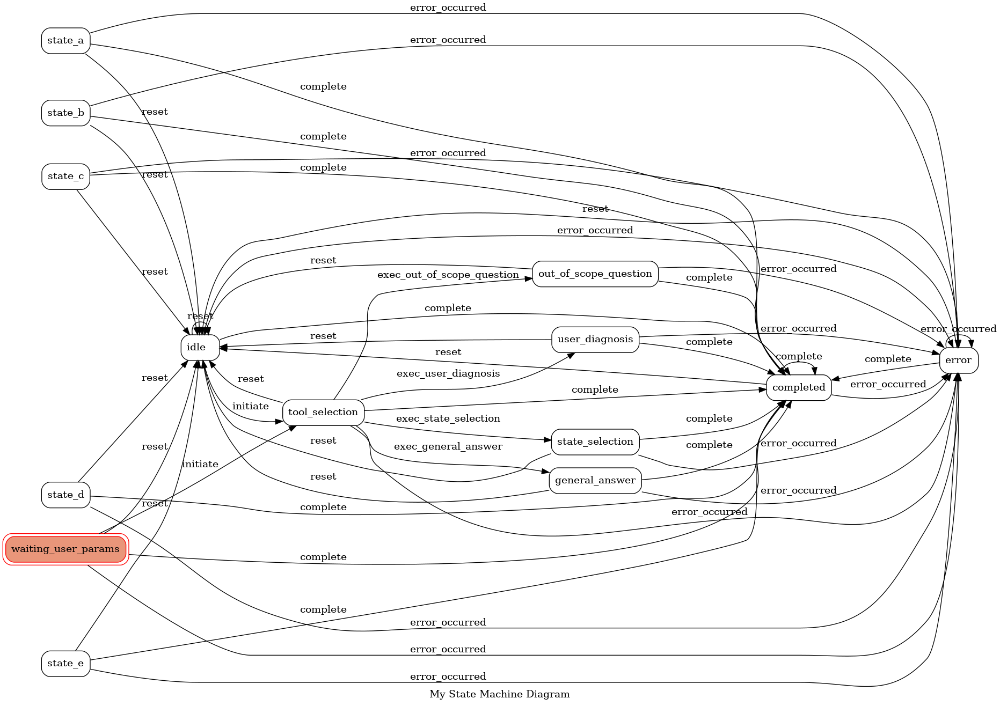

# AgentGraphMachine

This repository provides a powerful framework for creating AI agents using a state machine architecture, leveraging the capabilities GraphMachine from transitions library. 
At its core, the system uses a combination of state modeling, transitions, and intelligent agent planning to manage dynamic conversational AI behaviors. 
Here’s an introduction to its key features and potential:

State Machine-Driven AI Agents
The repository centers around a state machine model that orchestrates AI agent behaviors based on predefined states and transitions. The design uses the Transitions library with graph extensions to define a clear, visualizable workflow for an AI agent. 
In the project, you will find example states such as tool selection, general answer, etc., for demonstration purposes.

The library offers a wide range of functionalities for state machines, and you can choose the extensions that best suit your workflow needs.
For this project, the GraphMachine extension was used to visualize the state and transition graph, but many others are available such as HierarchicalMachine, LockedMachine, HierarchicalGraphMachine, LockedGraphMachine, LockedHierarchicalMachine, LockedHierarchicalGraphMachine, AsyncMachine, AsyncGraphMachine, HierarchicalAsyncMachine, and HierarchicalAsyncGraphMachine.
You can find all the information about the repository here: 
[https://github.com/pytransitions/transitions](https://github.com/pytransitions/transitions)


## Key Components:

### StateMachineModel:
Wraps a data model that holds the session’s context, history, and state data.
Manages state transitions and executes corresponding actions, such as invoking specific tools or responding to user queries.

### DataModel:
Contains essential session data such as session ID, user ID, chat history, current state, and counters for tracking interactions.

### Graph Machine Integration:
The transitions.extensions.GraphMachine enables a graphical representation of the state machine, making it easier to debug, visualize, and extend the AI agent’s decision-making pathways.

### Session Management:
The SessionManager handles persistence by storing and retrieving the session’s state from Redis. This ensures that interactions can be resumed seamlessly, and multiple sessions can be managed concurrently.

### Flask API Integration:
A Flask web server exposes endpoints (e.g., /run-ai-agent) to initiate or continue a conversation with the AI agent. It manages incoming requests, triggers the appropriate state machine flows, and returns the AI assistant’s responses as JSON.

### Save an image of the state and transition graph:
```python
model.get_graph().draw('newstate.png', prog='dot')
```




## Defining states and transitions:

Defining states and transitions for a user within this framework involves specifying the various stages of the conversation (states) and outlining the conditions or events that trigger movement from one state to another (transitions). Below is a step-by-step guide on how to define states and transitions using the transitions library and the repository’s structure as a reference.

### 1. Define States
States represent distinct phases or contexts in the conversation flow. In the provided repository, states are defined as a list of string identifiers. Each state corresponds to a specific behavior or handler in the state machine.

example:
 
```python 
states = [
    'idle',
    'tool_selection',
    'out_of_scope_question',
    'user_diagnosis',
    'waiting_user_params',
    'general_answer',
    'error',
    'completed'
]
```

### 2. Define Transitions
Transitions dictate how the state machine moves from one state to another based on triggers (events or method calls). Each transition is a dictionary that defines:

- A trigger: the event or method that causes the transition.
- A source: the state(s) from which the transition can occur.
- A destination: the state to move into once the transition is triggered.

example:
 
```python
transitions = [
    {
        'trigger': 'initiate',
        'source': ['idle', 'waiting_user_params'],
        'dest': 'tool_selection'
    },
    {
        'trigger': 'exec_out_of_scope_question',
        'source': 'tool_selection',
        'dest': 'out_of_scope_question' 
    },
    {
        'trigger': 'exec_user_diagnosis',
        'source': 'tool_selection',
        'dest': 'user_diagnosis'
    },
    {
        'trigger': 'exec_general_answer',
        'source': 'tool_selection',
        'dest': 'general_answer'
    },
    {
        'trigger': 'complete',
        'source': '*',
        'dest': 'completed'
    },
    {
        'trigger': 'error_occurred',
        'source': '*',
        'dest': 'error'
    },
    {
        'trigger': 'reset',
        'source': '*',
        'dest': 'idle'
    }
]
```


## Video Demo
Discover the capabilities of AgentGraphMachine with this [video demo](https://youtu.be/wXzuO-NZRw4).


# Application Setup

Follow the steps below to set up and run the pplication using Docker. This setup ensures that all necessary services are built and started correctly, with session management handled seamlessly via a Redis database.

## Prerequisites

- **Docker**: Ensure that Docker is installed on your system. You can download it from [here](https://www.docker.com/get-started).
- **Docker Compose**: Typically included with Docker Desktop installations. Verify by running `docker-compose --version`.

## Steps to Initialize the Application

 1. Clone the repository:

```bash
git clone https://github.com/mySanibot/interactive-multiagent.git
```

2. Navigate to the project directory:
```bash
cd interactive-multiagent
```

3. Build the Docker image:
```bash
docker-compose build
```

4. Run the Docker container:
```bash
docker-compose up -d
```

5. Check the backend logs:
```bash
docker logs -f flask_app
```

6. Access the application:
```bash
http://localhost:5000
```

- if you want to rebuild and restart the application:

```bash
docker-compose down
docker-compose build
docker-compose up -d
docker logs -f flask_app
```

- if you want to enter the app container's bash shell:
```bash
docker exec -it flask_app bash
```

- if you want to enter the redis container's bash shell and get session data:
```bash
docker exec -it redis sh
redis-cli
KEYS session:*
GET session:<sessionnumber>
```

